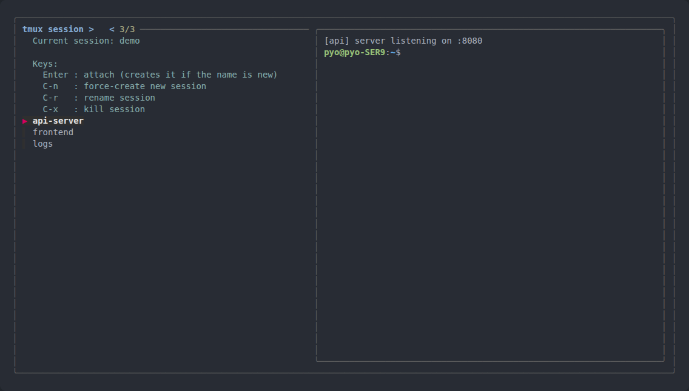
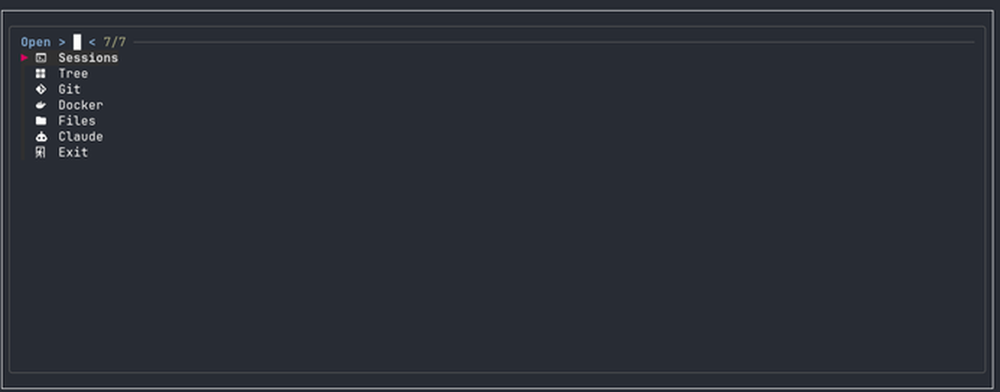

# tmux-session-kit

fzf-based tmux session management tools.



- **`ts` (tmux-sessions)** — session picker. **Outside** tmux it attaches; **inside**
  tmux it uses `switch-client`, so there are no nested-session problems.
- **`dev-launcher`** — tmux popup launcher (`Alt+q`) with Sessions / Tree /
  Git (lazygit) / Docker (lazydocker) / Files (yazi) / Claude menus.



## Install

```bash
git clone https://github.com/tmxhfwl/tmux-session-kit.git
cd tmux-session-kit
./install.sh
```

The installer asks for your display language (English / 한국어) on first run,
then (safe to re-run):

- Installs `tmux-sessions`, `dev-launcher`, and the `ts` symlink into `~/.local/bin/` — **overwriting existing files**
- Adds the `M-q` popup binding to `~/.tmux.conf` (managed marker block, refreshed on reinstall)
- Reloads the config on a running tmux server, if any

## Dependencies

| Kind | Package | Used for | When missing |
|---|---|---|---|
| **Required** | `tmux` | the thing being managed | installer aborts |
| **Required** | `fzf` | picker UI | installer aborts |
| Optional | `lazygit` | dev-launcher → Git | menu shows a notice |
| Optional | `lazydocker` | dev-launcher → Docker | menu shows a notice |
| Optional | `yazi` | dev-launcher → Files | menu shows a notice |
| Optional | `claude` | dev-launcher → Claude | menu shows a notice |

When running `./install.sh` interactively, you are asked per missing optional
tool whether to install it (`y/N`). Installs are sudo-free: Homebrew if
available, otherwise GitHub release binaries into `~/.local/bin`.

```bash
# Ubuntu/Debian
sudo apt install tmux fzf

# macOS
brew install tmux fzf
```

## Usage

| Key | Action |
|---|---|
| `Enter` | attach selected session (typing an unmatched name creates a new session) |
| `Ctrl-N` | force-create a session with the typed name |
| `Ctrl-R` | rename the selected session |
| `Ctrl-X` | kill the selected session (`1` = yes / `2` = no) |
| `Esc` | quit |

When run inside tmux, the current session is shown in the header and excluded
from the pick list. After rename/kill, the picker reloads with a fresh list.

## Language

The display language is stored in `~/.config/tmux-session-kit/config`
(`TSK_LANG=en` or `TSK_LANG=ko`). To change it, edit that file or delete it
and re-run `./install.sh`.

## Uninstall

```bash
./uninstall.sh
```

Removes the executables, the tmux.conf block, and the config directory.
